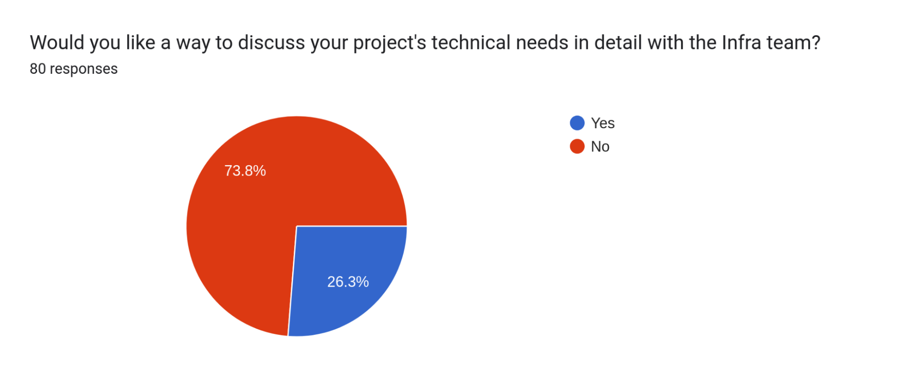

layout: post
title: 2022 Infra Survey Results
date: '2023-01-11'
permalink: 2022_infra_survey_results

### Intro
I'd like to thank everyone who took time to take the survey. This is the first time that I know of that we've tried something like this, and feedback is very important. I'd also like to take a second to clarify my tone for this article. I'm presenting as Chris T. the Infra person, not as an ASF Member or committer. So when I say "we" or "us", I'm referring to the other Infra folks, not specifically the Foundation as a whole or any Members. I am not posting the full results, but a summary of the data, as we had some responses that used enough information to identify the person being discussed. Those responses are 100% valid and I don't want to post an incomplete dataset with them removed.

### Summary of Results
We sent the survey to 4109 people (and anyone who went to the blog post would also have been able to complete the survey) and received 80 responses. While that isn't a huge number of results, it's a very manageable dataset to parse through. I also presume that some people submitting responses were conveying information gathered from other participants in their project. There weren't many surprises in responses, as we all know a lot of the pain points. However, it's vital for the Infra team to have data to back up our work and the resources we offer.

Here are the top subjects that were referred to:

    1. Public Jira access is a problem
    2. Communication is a problem
        1. Open/Public Slack
        2. General Infra communications
    3. CI/CD is a problem
        1. Capacity/Speed
        2. Platforms (Jenkins, Buildbot, GHA, etc.)
    4. Release process is a problem

The charts reflect the data above:

### Next Steps
The easy thing would be to say, “Let’s fix all the things!” To be honest, there is on-going work with all the above issues, but most of them are not subject to a quick fix or a short answer. Now that we have data and a baseline, we’ll evaluate and discuss how we’re going to address your concerns. Since that I’ve never done one of these surveys before, I do not have the next steps laid out, so we’ll have to take them together.